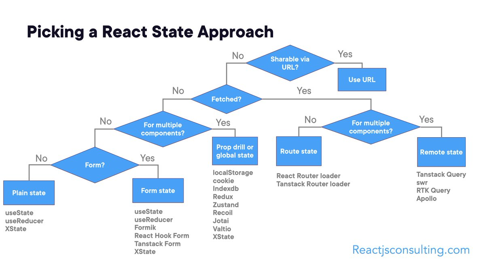

# June 2024

## 6/14/24

### Worked on

- Working on studying for the CS 519 midterm. Designing a GPT for helping out with the class.

### Articles

#### React State

*URL: https://threadreaderapp.com/thread/1799435036736778364.html?utm_source=tldrwebdev*

In React, state can be managed using several methods: local state within a component using `useState` or class-based `setState`, context state for global state management across the component tree using `useContext` and `Context API`, and third-party state management libraries like Redux, MobX, or Recoil for more complex and scalable state management solutions. Local state is ideal for managing state within a single component, while context state is useful for sharing state across multiple components without prop drilling. Third-party libraries offer advanced features like middleware, actions, and reducers, making them suitable for larger applications with intricate state management needs.

#### Engineering Metrics

*URL: https://hybridhacker.email/p/how-to-use-engineering-metrics?r=2bjtip&utm_medium=ios&utm_source=tldrwebdev&triedRedirect=true*

Delivery metrics are key performance indicators that measure the efficiency and effectiveness of the software delivery process. They include:

1. **Lead Time for Changes**: The time taken from the first commit of a feature to its deployment in production, indicating the speed of the development process.
2. **Release Frequency**: How often the organization deploys code, reflecting the agility of the release process.
3. **Mean Time to Restore (MTTR)**: The average time required to recover from a failure, showcasing the team's responsiveness and resilience.
4. **Change Failure Rate**: The percentage of deployments that cause a failure in production, highlighting the stability and quality of the releases.

These metrics, popularized by the DORA framework, help organizations measure and improve their software delivery performance.

## 6/16/24

### Worked on

- Working on studying for the CS 519 midterm. Designing a GPT for helping out with the class.

### Articles

#### Python notebooks are bad

*URL: https://yobibyte.github.io/notebooks.html?utm_source=tldrwebdev*

Notebooks, while convenient, encourage bad practices, lack proper versioning and state management, and can lead to inefficiencies and distractions, ultimately hindering both individual productivity and team collaboration.

#### Programming and thinking

*URL: https://agileotter.blogspot.com/2014/09/programming-is-mostly-thinking.html?utm_source=tldrnewsletter*

Because software production involves only electrons, its marginal cost is essentially zero, shifting the importance entirely to design. With an infinitely productive software factory, the primary focus would be on creating high-quality, well-thought-out designs rather than the physical act of coding itself.

## 6/17/24

### Worked on

- Working on studying for the CS 519 midterm. Designing a GPT for helping out with the class.
- Developing Adobe Analytics tagging.

### Articles

#### What is Interaction to Next Paint (INP)

*URL: https://vercel.com/blog/demystifying-inp-new-tools-and-actionable-insights*

Interaction to Next Paint (INP) is a metric that became part of Google’s Core Web Vitals in March 2024, measuring the time from a user interaction to the next paint of the web page. It emphasizes providing feedback to the user within 200ms to acknowledge their input, rather than completing all rendering tasks within this timeframe. Optimizing INP involves minimizing delays caused by third-party JavaScript, shortening event handler phases through techniques like React's memoization, and helping the browser render efficiently using tools like CSS containment. Real-world strategies, such as those used on Vercel's websites, include splitting the user interaction response into acknowledgment and action phases, ensuring immediate feedback without compromising performance.

#### Decoupling to improve pushing at GitHub

*URL: https://github.blog/2024-06-11-how-we-improved-push-processing-on-github/?utm_source=blog.quastor.org&utm_medium=referral&utm_campaign=how-github-rebuilt-their-push-processing-system*

GitHub improved its push processing by decoupling a massive background job into multiple isolated, parallel jobs using Kafka events, resulting in lower latency, better observability, and more reliable processing. This new system reduces the blast radius of errors, allows better ownership of push tasks, and processes pushes more efficiently, handling nearly all push events without failures.

#### Sleep deprivation disrupts memory

*URL: https://www.nature.com/articles/d41586-024-01732-y?utm_source=tldrnewsletter*

Sleep deprivation disrupts sharp-wave ripple activity in the hippocampus, which is crucial for memory formation, leading to weakened and less organized neural patterns even after subsequent normal sleep. This suggests a critical window for memory processing that, once missed, cannot be fully recovered, emphasizing the importance of continuous, quality sleep for effective memory consolidation. These findings could eventually inform treatments for memory-related conditions, potentially aiding in the management of traumatic memories in disorders like PTSD.

#### GenAI and more software engineers

*URL: https://roarepally.com/blog/ai-and-software-engineers?utm_source=tldrwebdev*

The article predicts that the demand for software engineers will increase over the next 20 years, driven by generative AI tools that enhance, rather than replace, traditional software engineering roles. This trend will make software engineering more accessible, creating more opportunities for innovation and increasing the need for top talent, while evolving the skill sets required in the field.

#### SaaS architecture (tons of automation)

*URL: https://anthonynsimon.com/blog/one-man-saas-architecture/?utm_source=tldrwebdev*

The article details the architecture and tools used by a one-person tech startup to run a SaaS application, highlighting the use of Kubernetes on AWS for managing infrastructure. The author emphasizes the importance of automation, reliability, and scalability, achieved through tools like Terraform, Flux, and Prometheus for version-controlled infrastructure, automated deployments, and monitoring. The setup includes managed services like Postgres and ClickHouse for data storage, Redis for caching, and Celery for scheduled tasks, all orchestrated within a Kubernetes cluster. The author stresses the benefits of a highly automated and resilient infrastructure, allowing minimal time spent on management and more on development. The article serves as a practical guide for software engineers interested in leveraging modern DevOps practices to efficiently manage and scale their own projects.