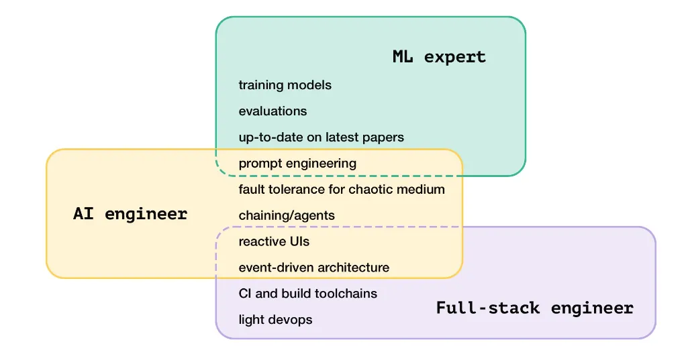

# July 2024

## 7/1/24

### Worked on

- Learned about the difference in Golden images
- Practiced fronted quiz questions using www.greatfrontend.com

### Articles

#### DevOps is over hyped, too hard, and people are going back to the basics

*URL: https://matduggan.com/a-eulogy-for-devops/?utm_source=tldrdevops*

> Having lots of mandatory technical employees they couldn't easily replace was a bummer
> Recruitment was hard and expensive.
> Sales couldn't easily inject whatever last-minute deal requirement they had into the release cycle since that was often set it stone.
> It provided an amazing opportunity for SaaS vendors to inject themselves into the process by offloading complexity into their stack so they pushed it hard.
> The change also emphasized the strengths of cloud platforms at the time when they were starting to gobble market share. You didn't need lots of discipline, just allocate more servers.
> Money was (effectively) free so it was better to increase speed regardless of monthly bills.
> Developers were understandably frustrated that minor changes could take weeks to get out the door while they were being blamed for customer complaints.

**DevOps in practice**

> Development makes a branch in git and adds a feature, fix, change, etc.
> They open up a PR and then someone else on that team looks at it, sees it passes their internal tests, approves it and then it gets merged into main. This is effectively the only safety step, relying on the reviewer to have perfect knowledge of all systems.
> This triggers a webhook to the CI/CD system which starts the build (often of an entire container with this code inside) and then once the container is built, it's pushed to a container registry.
> The CD system tells the servers that the new release exists, often through a Kubernetes deployment or pushing a new version of an internal package or using the internal CLI of the cloud providers specific "run a container as a service" platform. It then monitors and tells you about the success or failure of that deployment.
> Finally there are release-aware metrics which allow that same team, who is on-call for their application, to see if something has changed since they released it. Is latency up, error count up, etc. This is often just a line in a graph saying this was old and this is new.
> Depending on the system, this can either be something where every time the container is deployed it is on brand-new VMs or it is using some system like Kubernetes to deploy "the right number" of containers.

Containers really helped DevOps because it fixed the problem of "it works on my machine but not on yours"

DevOps aimed to unify development and operations teams, streamlining deployments to improve software delivery. However, it often led to inefficiencies and complexities, as organizations struggled with the practical challenges of communication, coordination, and maintaining consistency across environments. As a result, many teams now seek simpler, more stable solutions, focusing on practicality and genuine needs over rapid transformation and unnecessary complexity.

---

## 7/2/24

### Worked on

- Navigating between different applications using a cookie as the authentication token

### Articles 

#### Internet Bloat

*URL: https://tonsky.me/blog/js-bloat/?utm_source=tldrwebdev*

Even simple sites are shipping many MB of JavaScript to run the page. That's crazy!

#### Big Tech's Playbook for Swallowing AI

*URL: https://www.theverge.com/2024/7/1/24190060/amazon-adept-ai-acquisition-playbook-microsoft-inflection*

Big Tech companies are no longer able to high as they once did. Acquihires are becoming more common. An acquihire is where a startup is gutted for its people and left for dead. The new verison is a reverse acquihire where the people are hired and a licensing deal disguises what is actually an acquisition.

#### Why Copiolts and chatbots are bad for web dev

*URL: https://www.baldurbjarnason.com/2024/new-web-dev/?utm_source=tldrwebdev*

- Gmail was the exemplar that defined the ajax paradigm of thinking about web development.
- Facebook was the exemplar that defined the React and Component paradigm of web app development.

A paradigm is work done in the field.

React apps tend to be disproportionately complex. This stems from a thick abstraction layer over the base browser platform.

Maybe more plain JS and CSS will be coming.

#### Planning a week as a dev

*URL: https://read.highgrowthengineer.com/p/how-i-plan-my-week-as-a-senior-engineer?r=2bjtip&utm_source=tldrwebdev*

"I spend about 1 hour planning and reflecting. This plan makes me 25% more efficient for the other 39 hours in the week. That 25% efficiency saves me from 10 hours of misused time—more than a full day of work."

---

## 7/8/24

### Worked on

- Build a few NextJS components
- Learned a lot about Atomic CSS (I'm a total convert)

### Articles

#### Misconceptions about React Server Components 

*URL: https://www.builder.io/blog/nextjs-react-server-components?utm_source=tldrwebdev*

- Server components run on the server and have no impact on bundle size
- Client components are typical components. Only client can use React features like state, effects, access the DOM, etc.
- Client components should be placed as low as possible on the component tree. Ideally as leaf components.
- `'use client'` marks a client componenet while `'use server'` is the default in NextJS.
- You only need to add `'use client'` to the top most component.

#### 6 Most important DNS concepts

*URL: https://jonahdevs.com/youre-closer-than-you-think-the-only-6-dns-concepts-you-really-need/?utm_source=tldrnewsletter*

- A Records: map domain names to IPv4 addresses
  - Records can be used for subdomain mapping. Each subdomain can point to a different IP address (allows for hosting on different servers)
- CNAME Records - creates aliases for domain names
  - Must always be a domain name and never an IP address
- MX Records - specifies mail servers for handling email
- TXT Records - stores text strings and often used for domain verification
- NS Records - delegate a domain to name servers
  - Tell internet which servers are authoritative about domain's DNS information
- TTL - time to live (caching duration for DNS records)

#### Notes for New Hires

*URL: https://dev.clintonblackburn.com/2024/07/07/notes-for-new-hires?utm_source=tldrdevops

- Don't struggle in silence. Ask for help after 30 minutes.
- Ask "why?"
- Maintain a friction log. Notes on all the things causing trouble such as a tutorial missing steps or slow pipelines.
- Keep a brag doc for mid and end year reviews.

#### Think in Writing

*URL: https://www.henrikkarlsson.xyz/p/writing-to-think?utm_source=tldrwebdev*

Writing helps you think clearer.

#### Cache Optimization on NextJS without Vercel

*URL: https://semaphoreci.medium.com/cache-optimization-on-nextjs-without-vercel-c5927177ea02*

- SSG (static site generation) - accomplished with `getStaticProps` and `getStaticPaths` which are run during build time and retrieve data/produce HTML required for every page.
- ISR (incremental static regeneration) - renders HTML pages with most recent data. When request is received Next examines the cache. If the cache is fresh it is served immediately.
- Best practices for cache-control headers: differentiate between static content (like blog articles) and dynamic content (like user profiles)
- Client side cache: browser cache, localStorage, sessionStorage

#### Insights from comments using GPT-4o and LangChain

*URL: https://tamerc.com/posts/ask-hn-who-is-hiring/?utm_source=tldrwebdev*

Takeaways: job market is tough and using these services is crazy expensive. Categorizing 10,000 coments cost 54 dollars.

#### TypeScript 5.5 is out

*URL: https://devblogs.microsoft.com/typescript/announcing-typescript-5-5/?utm_source=tldrdevops*

TypeScript 5.5 is released! Cool! But I don't know nearly enough about nitty gritty JavaScript to make heads or tails of the new features.

#### Random Programming Beliefs

*URL: https://evanhahn.com/programming-beliefs-as-of-july-2024/?utm_source=tldrnewsletter*

- Different approaches for different tasks: creating a pacemaker then write tests! At a hackathon then no need for testing.
- "Throw away your first draft of your code"
- If you're banging your head then **take a break**
- Use positive versions of a variable to avoid double negatives

#### New to Web in June

*URL: https://web.dev/blog/web-platform-06-2024?hl=en&utm_source=tldrwebdev*

- JavaScript set methods
- Async clipboard API
- Color interpolation in CSS gradients

#### Web Dev to AI/ML

*URL: https://news.ycombinator.com/item?id=40866311&utm_source=tldrnewsletter*

Yes, its possible and take the [FastAI course](https://course.fast.ai)

#### Gradually then Suddenly: Small improvements leading to big changes

*URL: https://www.oneusefulthing.org/p/gradually-then-suddenly-upon-the?utm_source=tldrnewsletter*

Digital camera adoption was slow until it hit polaroid levels of quality and then it was almost vertical adoption.

Measuring AI threshold is more a matter of experience and vibes.

Keep an eye on the tresholds: “From this point on, the intelligence of LLMs… will only continue to improve. Human intelligence will not.”

#### AI Infrastructure is super hard

*URL: https://nextword.substack.com/p/why-ai-infrastructure-startups-are?utm_source=tldrnewsletter*

Think of AI infra like text processing services, vector databases, etc. Joining venture scale requires cracking the enterprise segment and incumbents integrations with enterprise are hard to overcome.

#### Hiring for AI skills

*URL: https://www.latent.space/p/hiring?r=2bjtip&utm_medium=ios&utm_source=tldrwebdev&triedRedirect=true*

- "Conventional software engineering skills. Especially back-end engineering on complex, data-intensive applications."
- "A genuine curiosity and enthusiasm for the capabilities of language models."

Example interview questions:
a. Update API endpoints to include extra metadata. Think about appropriate data types. Stub out frontend code to accept the new data.
b. Convert a synchronous REST API to an asynchronous streaming endpoint.
c. Cancellation of asynchronous work when a user closes their tab.
d. Choose an appropriate data structure to represent the pending, active, and completed ML work which is required to service a user request.

---

## 7/9/24

### Worked On

- Reviewed blue/green and different between deploying and releasing 
- Studied up on the value of Snapshot testing (faster and unit test)

### Articles

#### How GitHub Makes Money

*URL: https://productify.substack.com/p/how-github-grows-and-makes-money?utm_source=tldrproduct*

- AI powered tools, subscription plans, enterprise, and marketplace

#### Google Search is alive and well

*URL: https://qz.com/google-search-market-dominance-chatgpt-traffic-ai-1851580904?utm_source=tldrnewsletter*

- Google Search market share is 91.1% and ChatGPT vists are down

#### Maybe you're not sick of programming

*URL: https://shubhamjain.co/2024/06/27/youre-not-sick-of-programming/?utm_source=tldrwebdev*

- Possible that you're fed up with bueaucracy, lack of product vision, lack of ownership, pointless meetings.

#### Facebook launches multi-token-prediction

*URL: https://huggingface.co/facebook/multi-token-prediction*

Instead of predicting one tocken at a time it predicts multiple tokens out which improves accuracy and speed.

#### Reverse Engineering TicketMaster's Rotating Barcodes

*URL: https://conduition.io/coding/ticketmaster/?utm_source=tldrwebdev*

- The blue sweeping bar is just a CSS animation
- It is a [PDF417](https://en.wikipedia.org/wiki/PDF417) code
- Contains four parts: a bearer token in base64, two six digit number (TOTPs) and a unix timestamp
- Time based one time passwords ([TOTPs](https://en.wikipedia.org/wiki/Time-based_one-time_password)) - required shared secret and a working clock

---

## 7/10/24

### Articles

#### Guide to Upskilling SRE

*URL: https://reliabilityengineering.substack.com/p/becoming-a-senior-site-reliability?utm_source=tldrdevops*

- Key SRE skills: IaC, cloud services, networking and security, programming skills
- Soft skills: leadership and problem solving
- Cetifications to validate skills and knowledge

#### Current State of Browser Cookies

*URL: https://www.cyberark.com/resources/threat-research-blog/the-current-state-of-browser-cookies?utm_source=tldrdevops*

- Over 40% of websites use cookies.
- Safari binary stores cookies while Chrome and Firefox use an SQLite database

#### US Government Brilliantly Boring Websites

*URL: https://www.technologyreview.com/2024/06/26/1093656/us-government-website-design-accessibility/?utm_source=tldrwebdev*

Simple, accessible, effective. I'm honestly impressed by the US govs design docs.

---